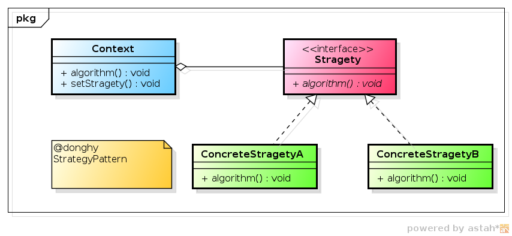

策略模式(Strategy Pattern)

-----

## 概述

在策略模式（Strategy Pattern）中，一个类的行为或其算法可以在运行时更改。这种类型的设计模式属于行为型模式。

在策略模式中，我们创建表示各种策略的对象和一个行为随着策略对象改变而改变的 context 对象。策略对象改变 context 对象的执行算法。

在程序客户端，可以通过注入不同的实现对象来实现策略的动态替换。

## 介绍

* <b>意图</b>：定义一系列的算法,把它们一个个封装起来, 并且使它们可相互替换。

* <b>主要解决</b>：在有多种算法相似的情况下，使用 if...else 所带来的复杂和难以维护。

* <b>何时使用</b>：
	* 一个系统有许多许多类，而区分它们的只是他们直接的行为。
	* 需要安全的封装多种同一类型的操作时
	* 出现同一个抽象类的多个子类，需要使用if-else或者switch来切换选择具体子类

* <b>如何解决</b>：将这些算法封装成一个一个的类，任意地替换。

* <b>关键代码</b>：实现同一个接口。

* <b>应用实例</b>：
	* 诸葛亮的锦囊妙计，每一个锦囊就是一个策略。 
	* 旅行的出游方式，选择骑自行车、坐汽车，每一种旅行方式都是一个策略。
	* JAVA AWT 中的 LayoutManager。

* <b>优点</b>： 
	* 算法可以自由切换。
	* 避免使用多重条件判断。
	* 扩展性良好。

* <b>缺点</b>： 
	* 策略类会增多。
	* 所有策略类都需要对外暴露。

* <b>使用场景</b>：
	* 如果在一个系统里面有许多类，它们之间的区别仅在于它们的行为，那么使用策略模式可以动态地让一个对象在许多行为中选择一种行为。
	* 一个系统需要动态地在几种算法中选择一种。
	* 如果一个对象有很多的行为，如果不用恰当的模式，这些行为就只好使用多重的条件选择语句来实现。

* 注意事项：如果一个系统的策略多于四个，就需要考虑使用混合模式，解决策略类膨胀的问题。

## 类图


其中：

* Context　－－　用来操作策略的上下文环境
* Stragety -- 策略的抽象
* ConcreateStragetyA ConcreateStragetyB -- 具体的策略实现

## 简单实现

实例：计算不同出行工具的成本：公交车，地铁。

- 创建一个接口

Strategy.java

```
public interface CalculateStrategy {
   public int  calculatePrice(int km);
}
```

- 创建实现接口的实体类
BusStrategy.java
```
public class BusStrategy implements CalculateStrategy{
   @Override
   public int calculatePrice(int km) {
      return km * 2;
   }
}
```

SubwayStrategy.java

```
public class SubwayStrategy implements CalculateStrategy{
   @Override
   public int calculatePrice(int km) {
      return km * 5;
   }
}
```

- 创建 Context 类: 提供计算出行方式的统一接口，这里其实有代理模式的意思在里面。

TranficCalculator.java
```
public class TranficCalculator {
   private Strategy strategy;

   public setStrategy(Strategy strategy){
      this.strategy = strategy;
   }

   public int calculatePrice(int km){
      return strategy.calculatePrice(km);
   }
}
```

- 拓展策略类：新增一个出租车类
TaxiStrategy.java
```
public class TaxiStrategy implements Strategy{
   @Override
   public int calculatePrice(int km) {
      return km * 10;
   }
}
```

- 使用 Context 来查看当它改变策略 Strategy 时的行为变化。

StrategyPatternDemo.java
```
public class StrategyPatternDemo {
   public static void main(String[] args) {
      TranficCalculator context = new TranficCalculator();
      // 选择地铁出行
      context.setStrategy(new SubwayStrategy())
      System.out.println("地铁1公里" + context.calculatePrice(1));
      // 选择公交车
      context.setStrategy(new BusStrategy())
      System.out.println("公交车1公里" + context.calculatePrice(1));
      // 选择出租车
      context.setStrategy(new TaxiStrategy())
      System.out.println("出租车1公里" + context.calculatePrice(1));
   }
}
```

## 策略模式与状态模式

区别：
-	状态模式将各个状态所对应的操作分离开来，即对于不同的状态，由不同的子类实现具体操作，不同状态的切换由子类实现，当发现传入参数不是自己这个状态所对应的参数，则自己给Context类切换状态；
- 而策略模式是直接依赖注入到Context类的参数进行选择策略，不存在切换状态的操作.

联系：
- 状态模式和策略模式都是为具有多种可能情形设计的模式，把不同的处理情形抽象为一个相同的接口，符合对扩展开放，对修改封闭的原则。
- 策略模式更具有一般性一些，在实践中，可以用策略模式来封装几乎任何类型的规则，只要在分析过程中听到需要在不同实践应用不同的业务规则，就可以考虑使用策略模式处理，在这点上策略模式是包含状态模式的功能的。

## 参考文档

* [策略模式|菜鸟教程](http://www.runoob.com/design-pattern/strategy-pattern.html)

* Android源码设计模式解析与实战